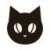

<p align="center">
  
</p>

<h1 align="center">blurssism</h1>

<p align="center">
  <a href="https://www.npmjs.com/package/@caffeinecatkr/blurssism"></a>
  <a href="https://cdn.jsdelivr.net/npm/@caffeinecatkr/blurssism/"></a>
  <a href="LICENSE"></a>
</p>

<p align="center">
  글래스모피즘과 블러 효과를 조합한, 웹·앱 공용 디자인 시스템 — 블러레마와 카페인 팔레트<br>
  A web &amp; app design system that combines glassmorphism with blur — Blurema crema and caffeine palettes<br>
  <a href="https://leeuc10.github.io/blurssism/">미리보기 Preview</a> ·
  <a href="docs/brand-book.md">브랜드북 Brand book</a> ·
  <a href="https://www.npmjs.com/package/@caffeinecatkr/blurssism">npm</a>
</p>

<p align="center"><a href="#한국어">한국어</a> · <a href="#english">English</a></p>

---

## 한국어

blurssism은 우유 거품 같은 크림색 바탕 위에 젖빛 크레마 **블러레마(Blurema)**를 **필요한 곳에만** 띄우는 디자인 시스템입니다. 유리 표현은 Apple Liquid Glass와 Samsung One UI에서 영감을 받았고, 색은 카페인에서 가져왔으며, 한국어 화면을 기준으로 만들었습니다.

**원칙**
1. **90 / 10.** 화면의 90% 이상은 종이(`paper`)와 먹(`ink`). 강조색은 10% 이내.
2. **떠 있는 것만 크레마로.** 내비게이션·탭바·시트·토스트만 크레마. 카드·입력창·리스트는 불투명.
3. **화면당 행동 하나.** primary 버튼은 한 화면에 하나.
4. **사람의 문장은 명조로.** 인용과 큰 이름만 Gowun Batang, 나머지 UI는 Pretendard.
5. **캡슐과 큰 모서리.** 누르는 것은 캡슐, 담는 것은 24px 이상.

**들어 있는 것**
- **블러레마 크레마**: 블러 위에 우유 거품 색, 거품 결, 팔레트를 따라가는 캐러멜빛 띠를 겹친 젖빛 면
- **크레마 모드 3단계**: 저사양 `off` · 기본 `on` · 데스크톱 `rich`(더 깊은 블러와 포인터 빛). 데스크톱 모드는 개발자가 켜고 끌 수 있음
- **브랜드색 팔레트**: 색 하나를 넣으면 라이트·다크 강조색을 WCAG 대비에 맞춰 자동 생성
- 팔레트 13종 × 라이트·다크. 카페인 6종(에스프레소·말차·차이·콜드브루·모카·클래식)과 웹 기본 7종(블루·인디고·바이올렛·틸·에메랄드·핑크·그래파이트). 브랜드색 팔레트까지 16,644개 대비 조합 모두 WCAG 통과(불투명한 바탕 7,884개 + 크레마 위 글자 8,760개, 크레마 뒤가 완전한 검정·흰색인 경우까지)
- 반응형 규정: 5단계 브레이크포인트, 4·8·12열 그리드, 단계별 제목 크기, 컴포넌트 배치 규칙
- 컴포넌트 29개: **React**(ESM·CommonJS·`<script>`)와 **Svelte 5**, 또는 CSS 클래스(`bl-*`)만으로도
- Next.js App Router·SvelteKit 서버 렌더링 안전, TypeScript 타입, Tailwind 프리셋
- 블러 성능 예산과 저사양 기기 자동 대응, 개발 중 예산 검사(`auditCrema()`)
- 접근성: 포커스 링, 네이티브 모달 다이얼로그, 방향키로 고르는 라디오 묶음·달력, 동작 줄이기·투명도 줄이기·고대비 모드 대응, 터치 영역 44px

### 다른 디자인 시스템과 다른 점

- **크레마가 다릅니다.** 맑은 유리와 흰 반사광 대신, 크림색 젖빛에 거품 결과 캐러멜빛 띠가 얹힌 블러레마를 씁니다. 띠 색은 팔레트를 따라갑니다.
- **크레마를 아껴 씁니다.** 화면당 크레마 개수를 규칙으로 정하고, 기기 성능에 맞춰 끄기·기본·데스크톱 세 단계로 자동으로 바뀝니다.
- **브랜드색을 넣어도 무너지지 않습니다.** 강조색만 바꾸고 바탕 90%는 그대로 두며, 대비는 자동 검사로 보장합니다.
- **한국어 화면이 기준입니다.** 글꼴, 해요체 문구, 줄바꿈 규칙까지 정해 두었습니다.

자세한 비교는 [브랜드북](docs/brand-book.md#다른-디자인-시스템과-다른-점)에 있어요.

### 설치

```bash
npm install @caffeinecatkr/blurssism
```

모든 페이지에 뷰포트 메타 태그가 있어야 반응형이 작동합니다: `<meta name="viewport" content="width=device-width, initial-scale=1">`

### React (Vite, Next.js …)

```jsx
import { Button, PalettePicker, Container, Grid, Card } from "@caffeinecatkr/blurssism";
import "@caffeinecatkr/blurssism/fonts.css";   // 글꼴(CDN). 직접 호스팅하면 빼도 됩니다
import "@caffeinecatkr/blurssism/tokens.css";
import "@caffeinecatkr/blurssism/bundle.css";

export default function App() {
  return (
    <Container className="bl-root">
      <PalettePicker />
      <Grid columns={{ xs: 1, md: 2, lg: 3 }}>
        <Card title="오늘의 원두" body="에티오피아 예가체프" />
      </Grid>
      <Button variant="accent" icon="plus">새로 만들기</Button>
    </Container>
  );
}
```

Next.js App Router에서는 CSS를 `app/layout.jsx`에서 불러옵니다. 컴포넌트는 서버 컴포넌트 파일에서 import해 그릴 수 있지만(패키지에 `"use client"`가 들어 있음), 함수 props(`onClick`, `Table`의 `render`·`format` 등)는 서버 컴포넌트에서 넘길 수 없으니 그런 부분은 `"use client"` 파일 안에서 씁니다. → [`examples/nextjs`](examples/nextjs) · [`examples/vite-react`](examples/vite-react)

### Svelte 5 (SvelteKit, Vite)

```svelte
<script>
  import { Button, PalettePicker, TextField, Dialog, breakpoint } from "@caffeinecatkr/blurssism/svelte";
  import "@caffeinecatkr/blurssism/fonts.css";
  import "@caffeinecatkr/blurssism/tokens.css";
  import "@caffeinecatkr/blurssism/bundle.css";
  let email = $state("");
  let open = $state(false);
  const bp = breakpoint();
</script>

<PalettePicker />
<TextField label="이메일" bind:value={email} />
<Button onclick={() => (open = true)}>열기</Button>
<Dialog bind:open title="저장할까요?">
  <Button variant="ghost" size="md" onclick={() => (open = false)}>취소</Button>
</Dialog>
{#if bp.current === "xs"}<p>폰 화면이에요</p>{/if}
```

입력 요소는 `bind:value`·`bind:checked`·`bind:open`을 지원하고, 슬롯 대신 스니펫(`{#snippet actions()}…{/snippet}`)을 씁니다. Svelte 5.20 이상이 필요합니다. → [`examples/sveltekit`](examples/sveltekit)

**글꼴**: `fonts.css`는 Pretendard와 Gowun Batang을 CDN에서 불러옵니다. CDN 없이 쓰려면(CSP·사내망·오프라인) `fonts.css` 자리에 `fonts.local.css`를 불러오면 끝입니다. 패키지에 든 글꼴 파일(`dist/fonts/`, SIL OFL)을 쓰고, Vite·Next.js·SvelteKit은 글꼴 파일을 알아서 함께 내보냅니다. 번들러 없이 쓰면 `dist/fonts.local.css`와 `dist/fonts/` 폴더를 같은 자리에 올립니다. 다른 글꼴로 바꾸려면 `--font-sans`·`--font-serif`를 덮어씁니다.

```js
import "@caffeinecatkr/blurssism/fonts.local.css";   // fonts.css 대신
```

React와 Svelte는 같은 CSS와 같은 함수 모듈(`/utils`)을 써서, 어느 쪽에서 `applyBrandColor()`나 `applyCremaPreference()`를 불러도 상태가 하나입니다. 이름이 다른 곳은 프레임워크 관례를 따른 것입니다.

| | React | Svelte |
| --- | --- | --- |
| 이벤트 | `onChange`, `onClick`, `onClose` | `onchange`, `onclick`, `onclose` |
| 양방향 값 | `value` + `onChange` (Chip은 `defaultSelected`로 스스로) | `bind:value`, `bind:checked`, `bind:selected`, `bind:open` |
| Table 칸 | `format(행)` 글자, `render(행)` 노드 | `format(행)` 글자, `cell` 스니펫 |
| Tooltip | 자식에 `aria-describedby` 자동 연결 | 스니펫이 받은 id를 직접 붙임 |
| Checkbox `label` | 글자 또는 노드 | 글자 또는 스니펫 |

### HTML · Vue (CSS만)

```html
<link rel="stylesheet" href="https://cdn.jsdelivr.net/npm/@caffeinecatkr/blurssism/dist/fonts.css">
<link rel="stylesheet" href="https://cdn.jsdelivr.net/npm/@caffeinecatkr/blurssism/dist/tokens.css">
<link rel="stylesheet" href="https://cdn.jsdelivr.net/npm/@caffeinecatkr/blurssism/dist/bundle.css">

<body class="bl-root">
  <div class="bl-container">
    <header class="bl-navbar bl-crema"><p class="bl-navbar-title">설정</p></header>
    <div class="bl-grid"><div class="bl-span-4 bl-span-lg-8">본문</div><div class="bl-span-4">옆</div></div>
    <button class="bl-btn bl-btn-primary">저장하기</button>
  </div>
</body>
```

### 팔레트 · 다크 모드

```html
<html data-palette="matcha" data-theme="dark">
```

| `data-palette` | 이름 | 느낌 |
| --- | --- | --- |
| `espresso` | 에스프레소 (기본) | 볶은 원두의 갈색과 크레마 |
| `matcha` | 말차 | 녹차의 차분한 초록 |
| `chai` | 차이 | 향신료 밀크티의 주황 |
| `coldbrew` | 콜드브루 | 차갑게 우린 커피의 깊은 남색 |
| `mocha` | 모카 | 초콜릿과 장미빛 코코아 |
| `classic` | 클래식 | 1.2까지의 자두색 |
| `blue` | 블루 | 링크와 버튼에서 가장 익숙한 파랑 |
| `indigo` | 인디고 | SaaS와 개발 도구에서 흔한 남보라 |
| `violet` | 바이올렛 | 창작 도구와 커뮤니티의 보라 |
| `teal` | 틸 | 헬스케어와 핀테크의 청록 |
| `emerald` | 에메랄드 | 결제와 성장 서비스의 선명한 초록 |
| `pink` | 핑크 | 커머스와 뷰티의 분홍 |
| `graphite` | 그래파이트 | 색 없이 먹색 하나로 쓰는 단색 |

코드로는 `setPalette("chai")`, `setTheme("dark" | "light" | "system")`. 테마를 지정하지 않으면 시스템 설정을 따릅니다. 사용자의 선택을 저장하는 것은 앱 몫입니다. `<PalettePicker group="web" />`처럼 한 묶음만 보일 수도 있습니다.

### 반응형

| 단계 | 너비 | 그리드 | 거터 · 여백 |
| --- | --- | --- | --- |
| `xs` | 0–599 | 4열 | 16 · 16 |
| `sm` | 600–767 | 8열 | 16 · 24 |
| `md` | 768–1119 | 8열 | 24 · 32 |
| `lg` | 1120–1439 | 12열 | 24 · 40 |
| `xl` | 1440+ | 12열 | 32 · 48 |

- `Container`/`.bl-container`로 폭을 맞추고, `Grid columns={{ xs: 1, md: 2, lg: 3 }}` 또는 `.bl-grid` + `.bl-span-md-6`으로 배치합니다.
- lg 미만: 하단 `TabBar`. md 미만에서는 `Dialog`가 아래 시트 모양이 되고 제목이 자동으로 작아짐.
- lg 이상: `NavBar` 링크가 나타나고 `TabBar`는 스스로 숨음(`hideFrom={false}`로 계속 보이기).
- 코드에서는 React `useBreakpoint()`, Svelte `breakpoint()`, 공통 `getBreakpoint()`·`isAtLeast("md")`.
- 터치 기기에서는 누르는 영역이 44px 이상(보이는 크기는 그대로, 달력은 폭 348px 이상일 때), 호버 효과는 마우스 기기에서만.

전체 규칙은 [브랜드북의 반응형 절](docs/brand-book.md#반응형)에 있습니다.

### Tailwind

```js
// tailwind.config.js — tokens.css도 함께 불러오세요
module.exports = { presets: [require("@caffeinecatkr/blurssism/tailwind")] };
```

`bg-paper`, `text-accent`, `rounded-full`, `backdrop-blur-md`, 그리고 같은 브레이크포인트(`sm:` `md:` `lg:` `xl:`)를 씁니다.

### 1.4에서 올릴 때 (이름 바꾸기)

1.5부터 코드 이름이 glass → crema로 바뀌었어요. 옛 이름은 2.0까지 그대로 동작하니 천천히 바꾸면 돼요. 옛 함수나 `variant="glass"`를 쓰면 개발 중에 콘솔에 한 번만 새 이름을 알려 주고, 화면에 남은 `.bl-glass`·`data-glass`는 `auditCrema()`가 찾아 줘요.

CSS 변수는 옛 이름(`--glass-*`)에 값이 있고 새 이름(`--crema-*`)이 그 값을 읽어요. 그래서 1.4처럼 `--glass-fill`을 덮어써도, 새로 `--crema-fill`을 덮어써도 반영돼요(1.5.0에서는 옛 변수를 덮어써도 반영되지 않았는데 1.6에서 고쳤어요). 1.4의 `--crema`(띠 색)는 `--crema-tint`가 읽어요.

| 1.4까지 (2.0에서 제거) | 1.5부터 |
| --- | --- |
| `.bl-glass` · `.bl-glass-thick` · `.bl-glass-lite` | `.bl-crema` · `.bl-crema-thick` · `.bl-crema-lite` |
| `.bl-btn-glass`, `variant="glass"` | `.bl-btn-crema`, `variant="crema"` |
| `<html data-glass="off\|on\|rich">` | `<html data-crema="off\|on\|rich">` |
| `applyGlassPreference()` · `setGlassMode()` · `getGlassMode()` · `shouldReduceGlass()` | `applyCremaPreference()` · `setCremaMode()` · `getCremaMode()` · `shouldReduceCrema()` |
| `GlassMode` · `GlassOptions` (타입) | `CremaMode` · `CremaOptions` |
| `--glass-fill` · `--glass-fill-strong` · `--glass-stroke` · `--glass-tint-accent` | `--crema-fill` · `--crema-fill-strong` · `--crema-stroke` · `--crema-tint-accent` |
| `--glass-edge` · `--glass-crema` · `--glass-grain` · `--glass-light` | `--crema-edge` · `--crema-band` · `--crema-grain` · `--crema-light` |
| `--shadow-glass` · `--glass-saturate` | `--shadow-crema` · `--crema-saturate` |

### 브랜드색 팔레트

```js
import { applyBrandColor } from "@caffeinecatkr/blurssism"; // Svelte는 ".../svelte", 바닐라는 ".../utils"
const palette = applyBrandColor("#ff5a1f");   // <html data-palette="brand">
palette.warnings.forEach((w) => console.warn(w.message));
```

바탕과 글자는 그대로 두고 강조색 묶음만 만듭니다. 흰 글자가 안 읽히는 밝은 색은 필요한 만큼만 어둡게 맞추고 원래 색은 장식색으로 남기며, 상태색과 헷갈리는 색은 경고합니다. 서버 렌더링에서는 `paletteToCss(createPalette("#ff5a1f"))`를 `<style>`에 넣고, 터미널에서는 `npx @caffeinecatkr/blurssism palette "#ff5a1f"`로 CSS를 받습니다.

### 크레마 모드 · 블러 예산

```js
import { applyCremaPreference } from "@caffeinecatkr/blurssism";
applyCremaPreference();                    // 기기에 맞춰 off · on · rich 자동
applyCremaPreference({ rich: false });     // 데스크톱 모드 끄기
applyCremaPreference({ rich: true });      // 데스크톱 모드 항상 켜기
```

| 모드 | 언제 | 블러 예산 |
| --- | --- | --- |
| `off` | 저사양·데이터 절약·투명도 줄이기 | 0 (불투명) |
| `on` | 기본, 모바일 | 화면당 3개 |
| `rich` | 1120px 이상 + 마우스 + 넉넉한 기기 | 화면당 6개, 블러 40/64px, 더 비치는 크레마, 두 겹 그림자, 포인터를 따라오는 캐러멜빛 |

반복 목록 안에서는 `.bl-crema-lite`(MediaCard는 `lite`), 블러 반경은 애니메이션하지 않습니다. 크레마 안의 아이콘 버튼과 다이얼로그 뒤 scrim은 블러를 걸지 않습니다.

```js
import { auditCrema } from "@caffeinecatkr/blurssism";
if (import.meta.env.DEV) auditCrema();   // 블러 예산 초과, primary 버튼 2개 이상, 옛 glass 이름을 콘솔로 알려 줌
```

저사양 기준은 `applyCremaPreference({ minMemory: 4, minCores: 4 })`로 바꿀 수 있어요(기본: 메모리 4GB 미만이면 `off`).

---

## English

blurssism floats **crema** — Blurema, a frosted, milk-tinted surface topped with a caramel crema band — **only where it's needed**, over a calm milk-foam cream background. The look is inspired by Apple Liquid Glass and Samsung One UI, the colors come from caffeine, and the system is designed with Korean typography as the default.

**Principles**
1. **90 / 10.** At least 90% of a screen is paper (`paper`) and ink (`ink`). Accent colors stay under 10%.
2. **Only floating things are crema.** Navigation bars, tab bars, sheets and toasts are crema. Cards, inputs and lists stay opaque.
3. **One action per screen.** Only one primary button per screen.
4. **Human words in serif.** Quotes and large names use Gowun Batang; the rest of the UI uses Pretendard.
5. **Capsules and large corners.** Anything you press is a capsule; anything that contains is 24px+.

**What's inside**
- **Blurema crema**: blur topped with a milk tint, a fine foam grain, and a caramel crema band that follows the palette.
- **Three crema modes**: `off` for low-end devices, `on` by default, and `rich` for desktop (deeper blur and a pointer light). Developers can turn desktop mode on or off.
- **Brand-color palettes**: pass one color and get light and dark accents tuned for WCAG contrast.
- 13 palettes × light and dark: 6 caffeine palettes (espresso, matcha, chai, cold brew, mocha, classic) and 7 web essentials (blue, indigo, violet, teal, emerald, pink, graphite). All 16,644 contrast pairs pass WCAG, brand-color palettes included: 7,884 on opaque surfaces and 8,760 for text on crema over a pure black or white backdrop.
- A responsive system: 5 breakpoints, a 4/8/12-column grid, per-breakpoint heading sizes, and component layout rules.
- 29 components for **React** (ESM, CommonJS, `<script>`) and **Svelte 5**, or use the CSS classes (`bl-*`) alone.
- Safe for server rendering in the Next.js App Router and SvelteKit. Ships TypeScript types and a Tailwind preset.
- A blur performance budget with automatic fallback on low-end devices, plus a dev-time budget check (`auditCrema()`).
- Accessibility: focus rings, native modal dialogs, arrow-key radio groups and calendar, reduced motion, reduced transparency and forced-colors support, 44px touch targets.

### What makes it different

- **Its own material.** Instead of clear glass with white highlights, Blurema is a cream, frosted crema with a foam grain and a caramel band that follows the palette.
- **Crema on a budget.** The number of crema surfaces per screen is a rule, and the crema switches between off, on and desktop modes to match the device.
- **Brand colors that don't break the look.** Only the accents change, 90% of the screen stays paper and ink, and contrast is checked automatically.
- **Korean-first.** Fonts, copy tone (해요체) and line breaking are all specified.

### Install

```bash
npm install @caffeinecatkr/blurssism
```

Responsive behavior requires a viewport meta tag on every page: `<meta name="viewport" content="width=device-width, initial-scale=1">`

### React

```jsx
import { Button, PalettePicker, Container, Grid, Card } from "@caffeinecatkr/blurssism";
import "@caffeinecatkr/blurssism/fonts.css";   // web fonts from a CDN; drop it if you self-host
import "@caffeinecatkr/blurssism/tokens.css";
import "@caffeinecatkr/blurssism/bundle.css";
```

In the Next.js App Router, import the CSS in `app/layout.jsx`. Components can be rendered from server component files (the package ships `"use client"`), but function props such as `onClick` or a Table column's `render`/`format` can't cross the server boundary, so use those inside a `"use client"` file. See [`examples/nextjs`](examples/nextjs) and [`examples/vite-react`](examples/vite-react).

### Svelte 5

```svelte
<script>
  import { Button, PalettePicker, TextField, breakpoint } from "@caffeinecatkr/blurssism/svelte";
  import "@caffeinecatkr/blurssism/fonts.css";
  import "@caffeinecatkr/blurssism/tokens.css";
  import "@caffeinecatkr/blurssism/bundle.css";
  let email = $state("");
  const bp = breakpoint();
</script>

<PalettePicker />
<TextField label="Email" bind:value={email} />
```

**Fonts**: `fonts.css` loads Pretendard and Gowun Batang from a CDN. To skip the CDN (CSP, intranet, offline), import `fonts.local.css` in its place and you're done: it uses the font files shipped in the package (`dist/fonts/`, SIL OFL), and Vite, Next.js and SvelteKit emit them for you. Without a bundler, serve `dist/fonts.local.css` next to the `dist/fonts/` folder. To use other fonts, override `--font-sans` and `--font-serif`.

Inputs support `bind:value`, `bind:checked` and `bind:open`. Use snippets (`{#snippet actions()}…{/snippet}`) instead of slots. Requires Svelte 5.20+. See [`examples/sveltekit`](examples/sveltekit).

### Palettes and dark mode

Set `<html data-palette="matcha" data-theme="dark">`, or call `setPalette("chai")` / `setTheme("dark" | "light" | "system")`. Without a theme, the system setting is followed. Persisting the user's choice is up to your app. Use `<PalettePicker group="web" />` to show one group only.

### Responsive

| Step | Width | Grid | Gutter · margin |
| --- | --- | --- | --- |
| `xs` | 0–599 | 4 col | 16 · 16 |
| `sm` | 600–767 | 8 col | 16 · 24 |
| `md` | 768–1119 | 8 col | 24 · 32 |
| `lg` | 1120–1439 | 12 col | 24 · 40 |
| `xl` | 1440+ | 12 col | 32 · 48 |

- Use `Container` / `.bl-container` for width, and `Grid columns={{ xs: 1, md: 2, lg: 3 }}` or `.bl-grid` with `.bl-span-md-6` for layout.
- Below lg, use a bottom `TabBar`. Below md, `Dialog` turns into a bottom sheet and headings shrink automatically. From lg up, `NavBar` links appear and the `TabBar` hides itself (pass `hideFrom={false}` to keep it).
- In code, use `useBreakpoint()` (React), `breakpoint()` (Svelte), or `getBreakpoint()` / `isAtLeast("md")`.
- Touch devices get 44px+ hit areas (the visible size stays the same). Hover effects only apply on devices with a mouse.

### Tailwind

```js
module.exports = { presets: [require("@caffeinecatkr/blurssism/tailwind")] };
```

Also load `tokens.css`. The `sm:` / `md:` / `lg:` / `xl:` breakpoints match blurssism.

### Upgrading from 1.4 (renamed to crema)

Since 1.5 the code names moved from glass to crema: `.bl-glass*` → `.bl-crema*`, `variant="glass"` → `"crema"`, `data-glass` → `data-crema`, `applyGlassPreference` / `setGlassMode` / `getGlassMode` / `shouldReduceGlass` → `applyCremaPreference` / `setCremaMode` / `getCremaMode` / `shouldReduceCrema`, and `--glass-*` → `--crema-*` (`--glass-crema` → `--crema-band`, `--shadow-glass` → `--shadow-crema`). The old names keep working until 2.0: overriding either `--glass-fill` or `--crema-fill` takes effect (fixed in 1.6; in 1.5.0 overriding the old variable did nothing). The old functions and `variant="glass"` log a one-time hint during development, and `auditCrema()` finds leftover `.bl-glass` / `data-glass` on the page.

### Brand-color palettes

```js
import { applyBrandColor } from "@caffeinecatkr/blurssism";
const palette = applyBrandColor("#ff5a1f");   // sets <html data-palette="brand">
```

Pass one color and blurssism builds the accent set for light and dark, tuned to pass WCAG contrast, while the paper and ink stay the same. Colors too bright for white text are darkened just enough, and the original is kept as the decoration color. You get warnings for colors that look like status colors. For SSR, use `paletteToCss(createPalette(color))`; from a terminal, `npx @caffeinecatkr/blurssism palette "#ff5a1f"`.

### Crema modes and blur budget

`applyCremaPreference()` picks `off` (low-end devices, data saver, reduced transparency), `on` (default, 3 crema surfaces per screen) or `rich`, a desktop mode for 1120px+ screens with a mouse and capable hardware (6 per screen, deeper blur, a caramel light that follows the pointer). Turn desktop mode off with `applyCremaPreference({ rich: false })`, force it with `{ rich: true }`, or use `setCremaMode("off" | "on" | "rich" | "auto")`. Use `.bl-crema-lite` inside repeated lists and never animate the blur radius. During development, `auditCrema()` warns when a screen goes over the blur budget or shows more than one primary button. Since 1.5 the code names are crema too (`bl-crema`, `data-crema`, `applyCremaPreference`); the 1.4 glass names keep working as aliases until 2.0.

The full rules are in the [brand book](docs/brand-book.md) (Korean).

---

## 문의 · Contact

질문, 제안, 협업 문의는 **leeunchan10@gmail.com**(caffeinecat)으로 보내 주세요. 버그는 [GitHub 이슈](https://github.com/leeuc10/blurssism/issues)에 남겨 주시면 가장 빨리 볼 수 있어요.<br>
Questions, ideas or collaboration: **leeunchan10@gmail.com** (caffeinecat). Please report bugs on [GitHub Issues](https://github.com/leeuc10/blurssism/issues).

## 라이선스 · License

- 코드, 토큰, 문서 / Code, tokens, docs: [MIT](LICENSE) © caffeinecat
- 로고와 표식 / Logos and marks (`logos/`): 권리 보유 / all rights reserved — [logos/LICENSE.md](logos/LICENSE.md)
- 글꼴 / Fonts: Pretendard와 Gowun Batang(둘 다 SIL OFL 1.1). `fonts.css`는 CDN에서 불러오고, `fonts.local.css`용 woff2 파일은 `dist/fonts/`에 라이선스와 함께 들어 있습니다 / `fonts.css` loads them from a CDN; the woff2 files for `fonts.local.css` ship in `dist/fonts/` with their licenses.

## 기여 · Contributing

원본은 `src/`에 있습니다: 토큰 `src/tokens.json`, 스타일 `src/bundle.css`, React `src/core.js`, Svelte `src/svelte/`, 공통 함수 `src/utils.js`.
`npm install` 후 `npm run build`로 `dist/`와 `svelte/`를 만들고, `npm run check`로 대비(크레마 위 포함), Svelte·React 타입, 서버 렌더링을 검사합니다. 같은 검사가 GitHub Actions에서도 돕니다.
Sources live in `src/`. After `npm install`, run `npm run build` to generate `dist/` and `svelte/`, and `npm run check` to verify contrast (including text on crema), Svelte and React types, and server rendering. CI runs the same checks.

<p align="center"><br><sub>made by caffeinecat</sub></p>
